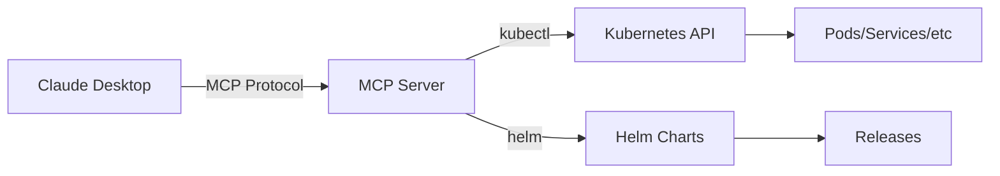

# 🚀 Kubernetes MCP Server

[](https://opensource.org/licenses/MIT)
[](https://www.typescriptlang.org/)
[](https://nodejs.org/)
[](https://kubernetes.io/)
[](https://modelcontextprotocol.io/)

Un servidor MCP (Model Context Protocol) que permite a Claude Desktop interactuar directamente con clusters de Kubernetes usando `kubectl` y `helm`. Proporciona herramientas para consultar pods, servicios, releases de Helm, analizar versiones y más.

## ✨ Características

- 🔌 **Integración directa con Claude Desktop** via MCP
- 🎯 **6 herramientas especializadas** para Kubernetes
- 🔒 **Servidor HTTPS** con certificados auto-generados
- 🐳 **DevContainer completo** con todas las herramientas
- 📊 **Análisis de versiones** y componentes desactualizados
- 🛠️ **Soporte para múltiples clusters** (minikube, EKS, GKE, etc.)

## 🛠️ Herramientas Disponibles

| Herramienta | Descripción | Parámetros |
|-------------|-------------|------------|
| `get_pods` | Lista pods del cluster | `namespace` (opcional) |
| `get_services` | Lista servicios | `namespace` (opcional) |
| `get_helm_releases` | Lista releases de Helm | `namespace` (opcional) |
| `get_cluster_info` | Información general del cluster | - |
| `get_namespaces` | Lista todos los namespaces | - |
| `analyze_versions` | Analiza versiones de componentes | `namespace`, `component` (opcionales) |

## 🚀 Inicio Rápido

### Prerrequisitos
- Node.js 18+
- Docker Desktop
- VS Code con extensión Dev Containers
- Acceso a un cluster Kubernetes

### 1. Clonar el Repositorio
```bash
git clone https://github.com/tu-usuario/k8s-mcp-server.git
cd k8s-mcp-server
```

### 2. Abrir en DevContainer
```bash
# En VS Code: Cmd+Shift+P → "Dev Containers: Reopen in Container"
```

### 3. Construir el Proyecto
```bash
npm install
npm run build
```

### 4. Configurar Claude Desktop
Crear archivo `~/Library/Application Support/Claude/claude_desktop_config.json`:
```json
{
  "mcpServers": {
    "k8s-versions": {
      "command": "node",
      "args": ["/ruta/al/proyecto/dist/index.js"],
      "env": {
        "KUBECONFIG": "/Users/tu-usuario/.kube/config"
      }
    }
  }
}
```

### 5. Reiniciar Claude Desktop
```bash
# Cerrar Claude Desktop completamente y volver a abrir
```

## 📖 Documentación

### 📚 Guías Principales
- **[Guía Rápida](docs/QUICK-START.md)** - Empezar en 5 minutos
- **[Setup HTTPS](docs/MCP-HTTPS-SETUP.md)** - Configuración completa con servidor HTTPS
- **[Configuración](docs/CONFIGURATION.md)** - Opciones avanzadas
- **[API Reference](docs/API.md)** - Documentación técnica completa

### 🎯 Ejemplos de Uso
- **[Ejemplos Prácticos](docs/EXAMPLES.md)** - Casos de uso reales

## 🏗️ Arquitectura



## 🧪 Desarrollo

### Scripts Disponibles
```bash
# Desarrollo
npm run dev              # Modo desarrollo con watch
npm run build           # Construir proyecto
npm run start           # Iniciar servidor MCP (stdio)

# Servidores HTTP/HTTPS
npm run start:http      # Servidor HTTP (puerto 3002)
npm run start:https     # Servidor HTTPS (puerto 3002)

# Testing
npm test               # Ejecutar tests
npm run test:coverage  # Tests con coverage
./scripts/test-mcp-https.sh  # Test completo del servidor HTTPS

# Calidad de código
npm run lint           # Linter
npm run type-check     # Verificación de tipos
npm run validate       # Lint + tipos + tests
```

### Estructura del Proyecto
```
📁 k8s-mcp-server/
├── 📁 src/                 # Código fuente TypeScript
│   ├── index.ts           # Servidor MCP principal (stdio)
│   ├── https-server.ts    # Servidor HTTPS para desarrollo
│   └── 📁 services/       # Servicios de Kubernetes y Helm
├── 📁 scripts/            # Scripts de utilidad
├── 📁 docs/              # Documentación completa
├── 📁 .devcontainer/     # Configuración DevContainer
└── 📁 dist/              # Código compilado
```

## 🎮 Ejemplos de Uso en Claude Desktop

Una vez configurado, puedes hacer preguntas como:

```
¿Qué pods tengo corriendo en mi cluster?
```

```
Muéstrame los releases de Helm instalados
```

```
Dame información general de mi cluster de Kubernetes
```

```
¿Hay algún problema con los pods en el namespace kube-system?
```

```
Analiza las versiones de mis componentes y dime cuáles están desactualizados
```

## 🐳 DevContainer

El proyecto incluye un DevContainer completo con:
- ✅ Node.js 18 + TypeScript
- ✅ kubectl, helm, minikube
- ✅ Docker-in-Docker
- ✅ VS Code extensions para Kubernetes
- ✅ Scripts de configuración automática

### Usar el DevContainer
1. Instalar VS Code + extensión "Dev Containers"
2. Abrir el proyecto en VS Code
3. `Cmd+Shift+P` → "Dev Containers: Reopen in Container"
4. Esperar a que se construya (primera vez ~5-10 min)
5. Ejecutar `./scripts/start-mcp-http.sh`

## 🔧 Configuración Avanzada

### Variables de Entorno
```bash
# Configuración de Kubernetes
KUBECONFIG=/path/to/kubeconfig
KUBECTL_NAMESPACE=default

# Configuración del servidor
PORT=3002
NODE_ENV=production

# Configuración de Minikube (DevContainer)
MINIKUBE_DRIVER=docker
MINIKUBE_MEMORY=4096
MINIKUBE_CPUS=2
```

### Múltiples Clusters
Puedes configurar múltiples servidores MCP para diferentes clusters:

```json
{
  "mcpServers": {
    "k8s-production": {
      "command": "node",
      "args": ["/ruta/al/proyecto/dist/index.js"],
      "env": {
        "KUBECONFIG": "/path/to/prod-kubeconfig"
      }
    },
    "k8s-staging": {
      "command": "node", 
      "args": ["/ruta/al/proyecto/dist/index.js"],
      "env": {
        "KUBECONFIG": "/path/to/staging-kubeconfig"
      }
    }
  }
}
```

## 🧪 Testing

### Tests Automatizados
```bash
# Tests unitarios
npm test

# Tests de integración
npm run test:coverage

# Test del servidor HTTPS
./scripts/test-mcp-https.sh

# Test completo del MCP
./scripts/test-mcp.sh
```

### Test Manual
```bash
# Probar herramientas MCP directamente
echo '{"jsonrpc": "2.0", "id": 1, "method": "tools/list"}' | node dist/index.js

# Probar herramienta específica
echo '{"jsonrpc": "2.0", "id": 1, "method": "tools/call", "params": {"name": "get_pods", "arguments": {}}}' | node dist/index.js
```

## 🚨 Troubleshooting

### Problemas Comunes

#### Claude Desktop no detecta el MCP
```bash
# Verificar archivo de configuración
ls ~/Library/Application\ Support/Claude/claude_desktop_config.json

# Verificar que el MCP funcione
echo '{"jsonrpc": "2.0", "id": 1, "method": "tools/list"}' | node dist/index.js

# Reiniciar Claude Desktop
pkill -f "Claude" && sleep 3
```

#### Error de conectividad con Kubernetes
```bash
# Verificar conectividad
kubectl cluster-info
kubectl get nodes

# Verificar configuración
echo $KUBECONFIG
kubectl config current-context
```

#### Problemas con el DevContainer
```bash
# Reconstruir container
# En VS Code: Cmd+Shift+P → "Dev Containers: Rebuild Container"

# Verificar herramientas
which kubectl helm minikube node
```

## 📊 Casos de Uso

### Para DevOps Engineers
- **Monitoreo rápido** de clusters desde Claude Desktop
- **Análisis de versiones** y components desactualizados
- **Troubleshooting interactivo** con IA

### Para Desarrolladores
- **Consultas rápidas** sobre deployments
- **Verificación de servicios** y pods
- **Análisis de configuraciones** Helm

### Para SREs
- **Auditoría de clusters** y versions
- **Detección de problems** con IA assistance
- **Documentación automática** de infraestructura

## 🤝 Contribuir

1. Fork el proyecto
2. Crear feature branch: `git checkout -b feature/nueva-funcionalidad`
3. Commit cambios: `git commit -am 'Agregar nueva funcionalidad'`
4. Push al branch: `git push origin feature/nueva-funcionalidad`
5. Crear Pull Request

### Desarrollo Local
```bash
# Instalar dependencias
npm install

# Desarrollo con auto-reload
npm run dev

# Ejecutar tests
npm test

# Lint código
npm run lint
```

## 📄 Licencia

Este proyecto está bajo la Licencia MIT - ver el archivo [LICENSE](LICENSE) para detalles.

## 🙏 Agradecimientos

- [Model Context Protocol](https://modelcontextprotocol.io/) por el protocolo MCP
- [Anthropic](https://www.anthropic.com/) por Claude Desktop
- [Kubernetes](https://kubernetes.io/) y [Helm](https://helm.sh/) por las herramientas
- Comunidad open source por las librerías utilizadas

## 📞 Soporte

- **Issues**: [GitHub Issues](https://github.com/tu-usuario/k8s-mcp-server/issues)
- **Discussions**: [GitHub Discussions](https://github.com/tu-usuario/k8s-mcp-server/discussions)
- **Documentation**: [/docs](docs/)

---

**¿Te gusta este proyecto? ⭐ Dale una estrella en GitHub!**